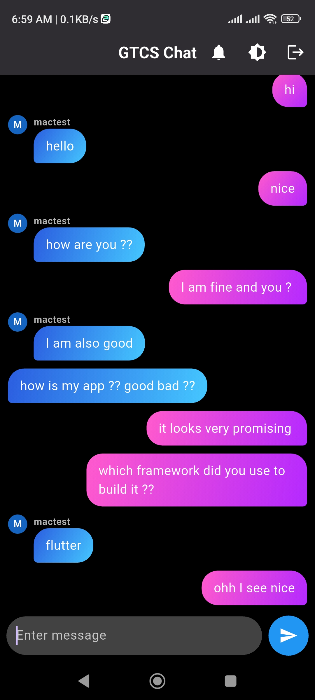

# gtcs_chat

Real-time Chat App (Flutter, Firebase)
Built a real-time chat application using Flutter, with Firebase for user authentication and Firestore for real-time messaging. The app allows users to securely sign in, send messages, and receive updates instantly, providing an interactive communication experience.

## Getting Started

This project is a starting point for a Flutter application.

A few resources to get you started if this is your first Flutter project:

- [Lab: Write your first Flutter app](https://docs.flutter.dev/get-started/codelab)
- [Cookbook: Useful Flutter samples](https://docs.flutter.dev/cookbook)

For help getting started with Flutter development, view the
[online documentation](https://docs.flutter.dev/), which offers tutorials,
samples, guidance on mobile development, and a full API reference.

## Screenshots

  
  

