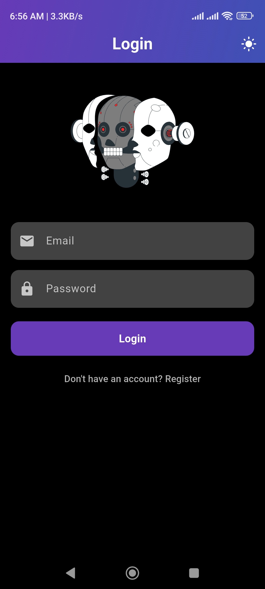

# gtcs_chat

Real-time Chat App (Flutter, Firebase)
Built a real-time chat application using Flutter, with Firebase for user authentication and Firestore for real-time messaging. The app allows users to securely sign in, send messages, and receive updates instantly, providing an interactive communication experience.

## Screenshots

  
  

